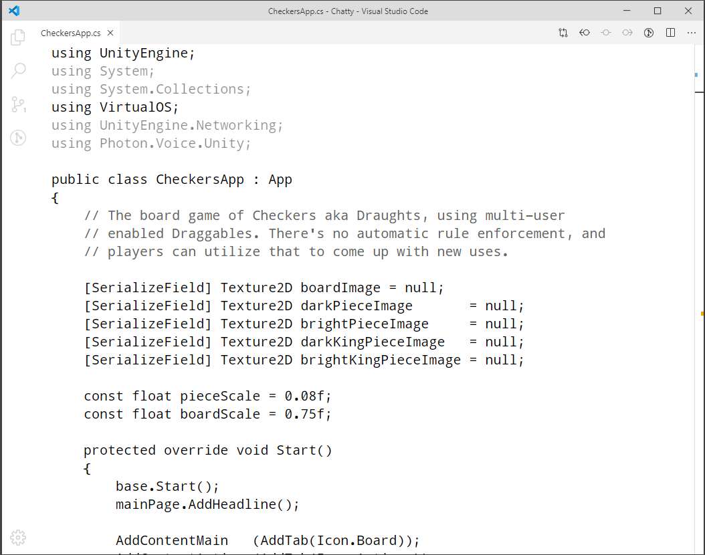

# VSCodeMinimal
 An extremely minimalistic, white on black, focus-oriented Settings.json for Visual Studio Code, with an optimized font adjusted from Droid Monospace (with easily visible emphasizes, and strongly separating otherwise easy-to-confuse character couples like "{" vs "(", or ";" vs ":").

To install this, grab the Extension Theme "Black and White" which this overrides, then search the VS Code settings for settings.json and replace the file. Have fun!